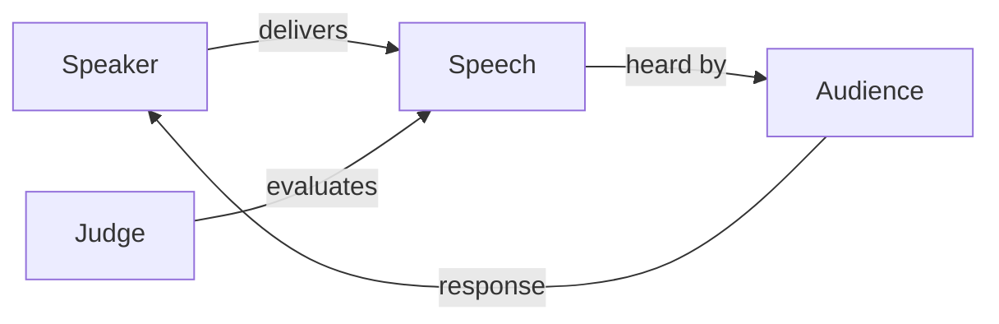

### Architecture Diagram – Structural Systems View
Excellent for people who think in systems, not scenes.
#### Code
```text
flowchart LR
    Speaker -->|delivers| Speech
    Speech -->|heard by| Audience
    Audience -->|response| Speaker
    Judge -->|evaluates| Speech
```
#### Rendered Diagram

---
#### Significance
Provides a **high level overview** of system design.