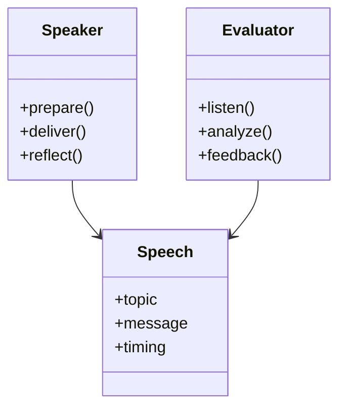

### Class Diagram – Abstract Structure & Responsibility
Perfect for people who think in *roles and interfaces*.
#### Code
```text
classDiagram
    class Speaker {
        +prepare()
        +deliver()
        +reflect()
    }

    class Speech {
        +topic
        +message
        +timing
    }

    class Evaluator {
        +listen()
        +analyze()
        +feedback()
    }

    Speaker --> Speech
    Evaluator --> Speech
```
#### Rendered Diagram

---
#### Significance
**This mirrors internal logic models**, not pictures.