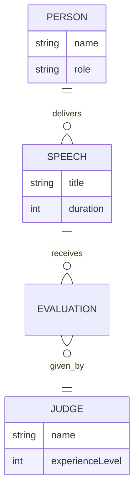

Ideal for explaining *relationships*, not appearances.
#### Code
```text
erDiagram
    PERSON ||--o{ SPEECH : delivers
    SPEECH ||--o{ EVALUATION : receives
    EVALUATION }o--|| JUDGE : given_by

    PERSON {
        string name
        string role
    }

    SPEECH {
        string title
        int duration
    }

    JUDGE {
        string name
        int experienceLevel
    }
```
#### Rendered Diagram

---
#### Significance
**Why this is gold:**
ERDs are pure structure—no visual imagination required.