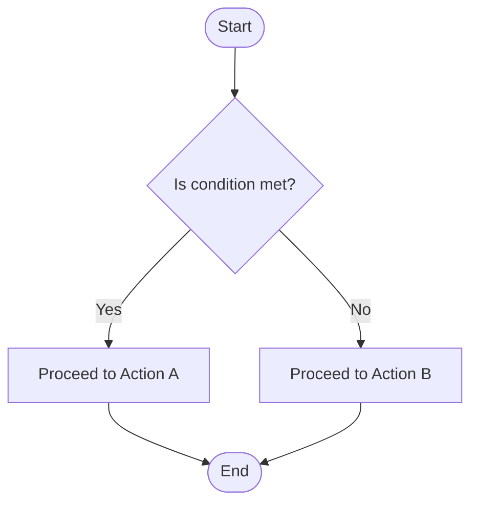

### Flowchart – Logical Process & Decision Structure

This is the most intuitive entry point: *if → then → else*.
#### Code

```text
flowchart TD
    Start([Start])
    Question{Is condition met?}
    YesPath[Proceed to Action A]
    NoPath[Proceed to Action B]
    End([End])

    Start --> Question
    Question -->|Yes| YesPath
    Question -->|No| NoPath
    YesPath --> End
    NoPath --> End
```
#### Rendered Diagram


---
#### Significance
**Why this matters for aphantasia:**
Flowcharts externalize reasoning—no visualization required, just logic and relationships.