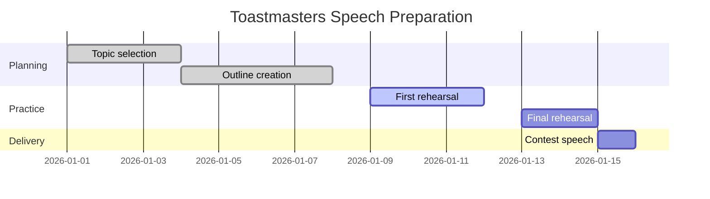

### Gantt Chart – Time, Planning, Constraint
Highly concrete and practical.
#### Code
```text
gantt
    title Toastmasters Speech Preparation
    dateFormat  YYYY-MM-DD

    section Planning
    Topic selection        :done, 2026-01-01, 3d
    Outline creation       :done, 2026-01-04, 4d

    section Practice
    First rehearsal        :active, 2026-01-09, 3d
    Final rehearsal        :2026-01-13, 2d

    section Delivery
    Contest speech         :2026-01-15, 1d
```
#### Rendered Diagram

---
#### Significance
**Aphantasia-friendly:**
Time blocks > mental pictures.