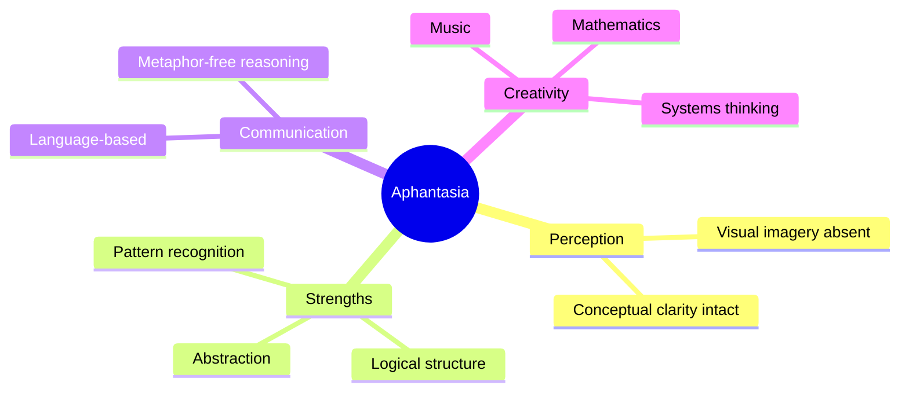

### Mind Map – Conceptual Association Without Imagery

Mermaid mind maps are *structural*, not pictorial.

#### Code

```text
mindmap
  root((Aphantasia))
    Perception
      Visual imagery absent
      Conceptual clarity intact
    Strengths
      Pattern recognition
      Logical structure
      Abstraction
    Communication
      Language-based
      Metaphor-free reasoning
    Creativity
      Music
      Mathematics
      Systems thinking
```
#### Rendered Diagram

---
#### Significance
**Key insight:**
This mirrors how many aphantasic thinkers describe thought—as *semantic adjacency* rather than pictures.