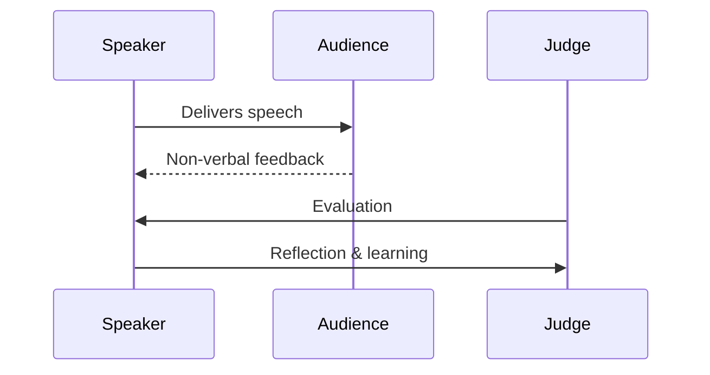

********###  Sequence Diagram – Temporal & Interaction Structure
Great for conversations, protocols, and cause–effect chains.

#### Code

```text
sequenceDiagram
    participant Speaker
    participant Audience
    participant Judge

    Speaker->>Audience: Delivers speech
    Audience-->>Speaker: Non-verbal feedback
    Judge->>Speaker: Evaluation
    Speaker->>Judge: Reflection & learning
```

#### Rendered Diagram


---
#### Significance
**Why it resonates:**
Time and interaction are inherently structural—even without imagery.