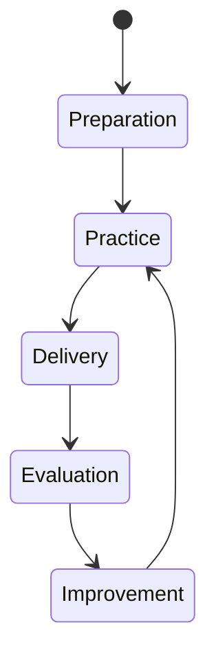

### State Diagram – Conditions & Transitions
Useful for mental states, learning stages, or system modes.
#### Code
```text
stateDiagram-v2
    [*] --> Preparation
    Preparation --> Practice
    Practice --> Delivery
    Delivery --> Evaluation
    Evaluation --> Improvement
    Improvement --> Practice
```
#### Rendered Diagram

---
#### Significance
**This is cognition-as-machinery:**
States + transitions = meaning without pictures.