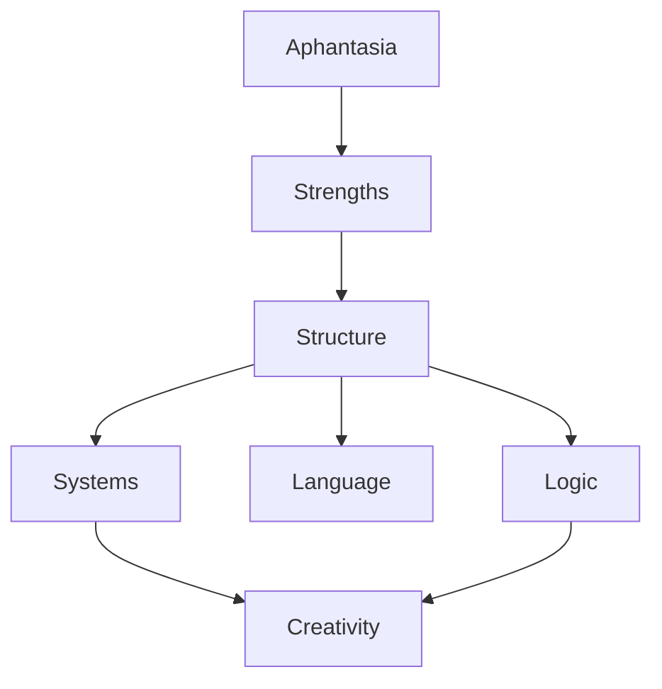

### Structural Summary Diagram (Meta!)
This one explicitly reframes aphantasia as *structural cognition*.
#### Code
```text
flowchart TB
    Aphantasia --> Strengths
    Strengths --> Structure
    Structure --> Logic
    Structure --> Language
    Structure --> Systems
    Systems --> Creativity
    Logic --> Creativity
```
#### Rendered Diagram

---
#### Significance
Illustrates **aphantasia reframed** rather than as a defect.